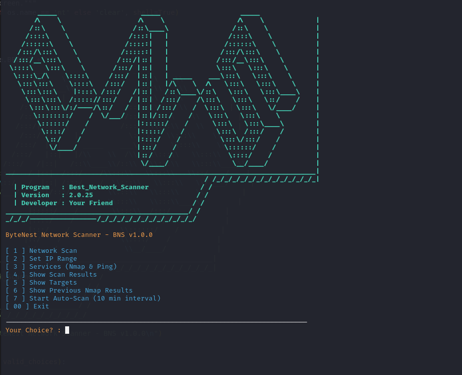

# Best Network Scanner (BNS)

## English Version 🔤

### 🔍 About BNS
**Best Network Scanner (BNS)** is a powerful and efficient tool designed for scanning network devices, open ports, and vulnerabilities. It provides essential insights for cybersecurity professionals, network administrators, and ethical hackers.

> ⚠️ **Responsible Use Only!** This tool is intended for ethical hacking, penetration testing, and network analysis. Any misuse for unauthorized access is strictly prohibited.

---

### 🚀 Features
- Scan networks and discover active devices.
- Detect open ports and services.
- Save scan results in JSON format.
- Automatic periodic scanning (every 10 minutes).
- Interactive and user-friendly CLI.

---

### 🛠 Installation

#### Prerequisites:
- A Linux-based OS (Kali, Debian, Ubuntu, Arch Linux, or Termux on Android)
- Python 3.x
- Required dependencies (install using the command below)

#### Setup Instructions:

1. Clone the repository or download the source code.
2. Navigate to the project directory.
3. Give the `setup.sh` script execution permission:

   ```bash
   chmod +x setup.sh
   ```

4. Run the script:

   ```bash
   ./setup.sh
   ```

This script will automatically detect your Linux distribution (Kali, Debian, Ubuntu, Arch, or Termux) and install the necessary dependencies such as `python3`, `pip`, and `nmap`.

---

### 📌 Usage
Once the installation is complete, you can start using **BNS**:

```bash
bns
```

Set your desired IP range and start scanning!

---

### 📝 License & Disclaimer
This project is for **educational** and **ethical** purposes only. The developer is not responsible for any misuse or illegal activities related to this tool.

---

## نسخه فارسی 🇮🇷

### 🔍 درباره BNS
**Best Network Scanner (BNS)** یک ابزار قدرتمند برای اسکن دستگاه‌های شبکه، پورت‌های باز و شناسایی آسیب‌پذیری‌ها است. این ابزار برای متخصصان امنیت، مدیران شبکه و هکرهای اخلاقی طراحی شده است.

> ⚠️ **تنها برای استفاده قانونی!** این ابزار فقط برای تست نفوذ و تحلیل امنیت شبکه طراحی شده است. هرگونه سوءاستفاده از آن غیرقانونی است.

---

### 🚀 ویژگی‌ها
- اسکن شبکه و کشف دستگاه‌های فعال
- شناسایی پورت‌های باز و سرویس‌ها
- ذخیره نتایج اسکن در فرمت JSON
- اسکن خودکار هر ۱۰ دقیقه
- رابط کاربری تعاملی و کاربرپسند

---

### 🛠 نصب

#### پیش‌نیازها:
- سیستم عامل مبتنی بر لینوکس (کالی، دبیان، اوبونتو، آرچ لینوکس یا ترموکس روی اندروید)
- پایتون 3.x
- نصب وابستگی‌ها با دستور زیر:

#### دستورالعمل‌های نصب:

1. مخزن پروژه را کلون کنید یا کد منبع را دانلود کنید.
2. به پوشه پروژه بروید.
3. به اسکریپت `setup.sh` مجوز اجرای داده و آن را اجرا کنید:

   ```bash
   chmod +x setup.sh
   ```

4. سپس اسکریپت را اجرا کنید:

   ```bash
   ./setup.sh
   ```

این اسکریپت به طور خودکار توزیع لینوکس شما را تشخیص داده و وابستگی‌های لازم مثل `python3`، `pip` و `nmap` را نصب می‌کند.

---

### 📌 نحوه استفاده
بعد از تکمیل نصب، می‌توانید **BNS** را با دستور زیر اجرا کنید:

```bash
bns
```

سپس محدوده IP مورد نظر خود را تنظیم کرده و اسکن را شروع کنید!

---

### 📝 مجوز و سلب مسئولیت
این پروژه فقط برای **آموزش** و **استفاده اخلاقی** توسعه داده شده است. هرگونه سوءاستفاده از آن غیرقانونی بوده و توسعه‌دهنده هیچ مسئولیتی در قبال استفاده نادرست از این ابزار ندارد.

---




---

💻 Developed by **Your Friend** | Version: **2.1.0**

---